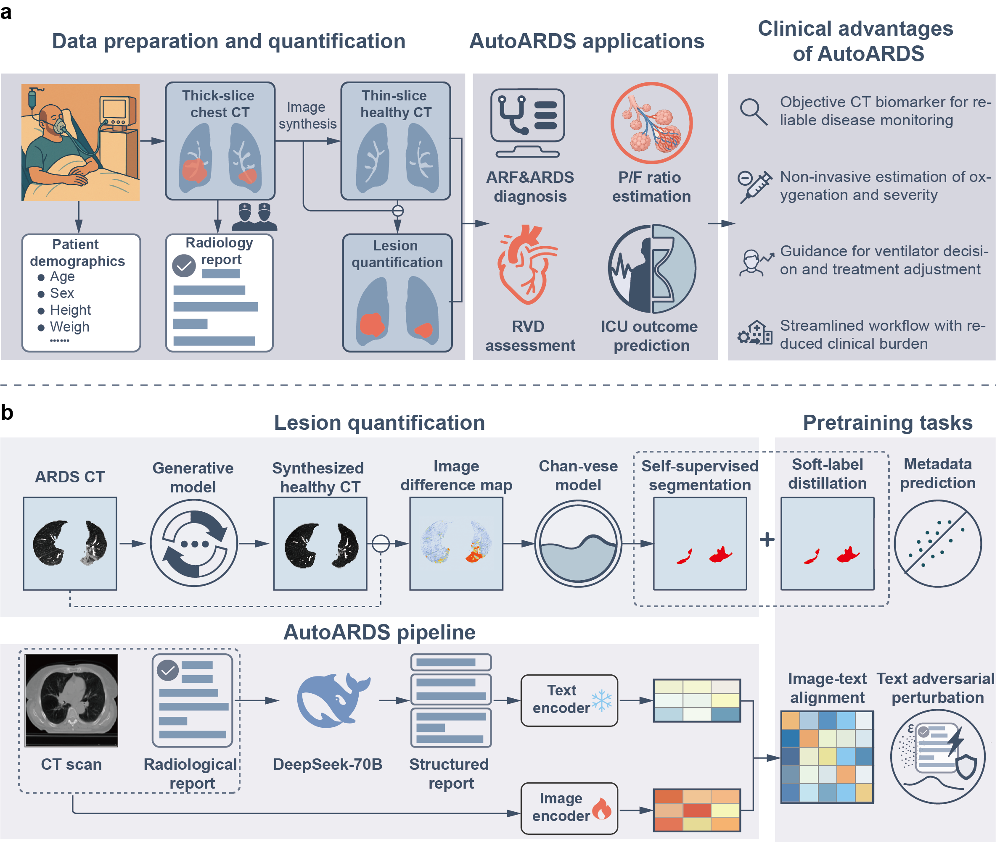
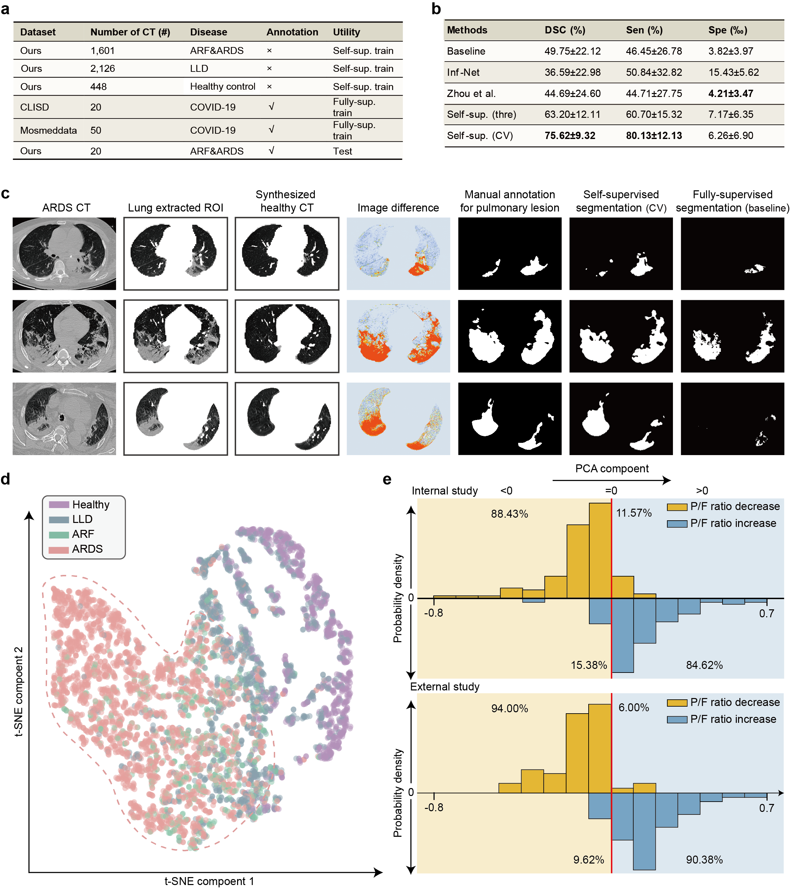
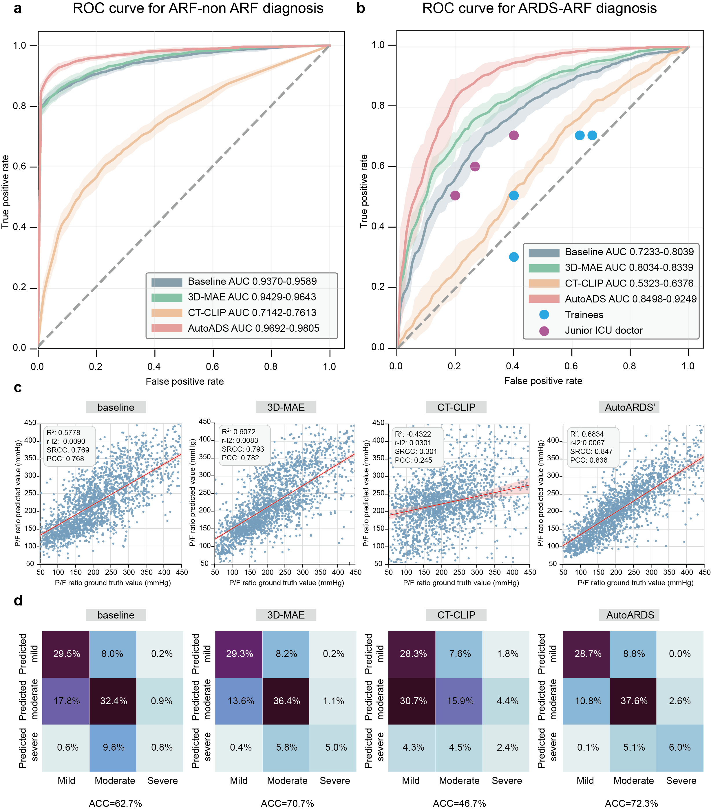

# AutoARDS

Official repository for the manuscript:

> **AutoARDS: A Foundation Model for Acute Respiratory Distress Syndrome (ARDS) Analysis and Diagnosis via Transforming Chest CT into a Quantitative Tool.**

---

## Introduction

Acute respiratory distress syndrome (ARDS) remains a major concern in intensive care units (ICUs), with mortality rates exceeding **40%**. Although chest CT is routinely performed in ARDS evaluation, its role has traditionally been qualitative and subjective.

**AutoARDS** is the first CT-based foundation model that transforms chest CT into a quantitative tool for ARDS evaluation and management. It integrates lesion quantification, multimodal representation learning, and prognosis modelling into a single pipeline.

<p align="center">
  
</p>

### Key Results

| Task | Metric | Value |
|------|--------|-------|
| Self-supervised lesion segmentation | Dice | 75.62% |
| ARF vs. non-ARF diagnosis | AUC | 0.9692 – 0.9805 |
| ARDS within ARF | AUC | 0.8498 – 0.9249 |
| P/F ratio estimation | Pearson r | 0.793 – 0.878 |
| Berlin severity stratification | Accuracy | 72 – 75% |
| RVD estimation | AUC | 0.6715 – 0.8564 |
| 28-day survival (time-averaged) | AUC | 0.7872 |

---

## Project Structure

```
AutoARDS/
├── model/
│   ├── model.py                # Downstream task models (classification, regression, survival)
│   ├── pretrain_model.py       # AutoARDS pretraining model (image-text + seg + metadata)
│   └── MedNext/                # 3D image encoder (MedNeXt backbone)
│       ├── MedNext_model.py    # MedNeXt_encoder, MedNeXt_decoder, MedM3AE
│       ├── mednext/            # MedNeXt building blocks (MedNeXtBlock, MedNeXtDownBlock …)
│       ├── losses/
│       └── unetr/
├── train/
│   ├── utils.py                # All Dataset classes
│   ├── train_pretrain.py       # Stage 1 — pretraining (image-text + soft-label + metadata)
│   ├── train_classification.py # Stage 2 — ARF/ARDS severity diagnosis
│   ├── train_regression.py     # Stage 2 — P/F ratio (OI) estimation
│   ├── train_blood.py          # Stage 2 — blood gas (PaCO2) estimation
│   └── train_prognosis.py      # Stage 2 — 28-day survival prediction
├── lesion_quantification.py    # 8-metric lesion quantification from CT + segmentation mask
├── basic_model/                # Compatibility alias for unetr sub-modules
└── visualization/              # Minimal plotting stubs used by loss functions
```

---

## Note on the Image Encoder

Although the default backbone throughout this codebase is **MedNeXt**, the overall AutoARDS pipeline is **network-agnostic**.  
Any 3D encoder that accepts `(B, C, H, W, D)` tensors and returns a list of feature maps  
(where `features[0]` is the deepest/bottleneck feature) can be plugged in.

Typical candidates include:

| Model | Notes |
|-------|-------|
| MedNeXt (default) | Convolutional, strong medical imaging inductive bias |
| SwinUNETR | Transformer-based, already imported in `model/model.py` |
| nnU-Net encoder | ConvNet, widely used as a strong baseline |
| UNETR / UNETR++ | Hybrid transformer |
| Simple 3D ResNet / U-Net | Lightweight alternative |

To swap the encoder, replace the `image_encoder` attribute in `AutoARDS_Pretrain`  
(`model/pretrain_model.py`) or `MedNeXt_regression_info` (`model/model.py`).  
The projection heads, loss functions, and training loops are all encoder-independent.

---

## Environment Setup

### Requirements

- Python 3.8+
- PyTorch ≥ 2.0 with matching CUDA toolkit
- `torchvision` version must match your PyTorch version (see [PyTorch compatibility matrix](https://github.com/pytorch/vision#installation))

### Install dependencies

```bash
pip install torch torchvision --index-url https://download.pytorch.org/whl/cu128  # adjust cu version
pip install monai transformers timm einops lungmask scipy pandas openpyxl tqdm scikit-learn
```

### MedNeXt backbone setup

The `model/MedNext/mednext/` directory must contain the MedNeXt building blocks  
(`MedNeXtBlock`, `MedNeXtDownBlock`, `MedNeXtUpBlock`).  
A minimal reference implementation is included; for the full version refer to the  
[official MedNeXt repository](https://github.com/MIC-DKFZ/MedNeXt).

---

## Data Preparation

### CT arrays

Each CT scan is stored as a `.npz` file. Supported key names: `data` or `arr_0`.  
HU values are expected; all loaders normalise with:

```python
data = np.clip((data + 1000.0) / 1600.0, 0, 1)
```

### Spreadsheet layout

Each task reads an Excel workbook (`.xlsx`). The expected sheet names and columns are:

| Sheet | Columns | Used by |
|-------|---------|---------|
| `B&G_2` | `[path, lung_vol, feat_0..7, age, fio2, pao2, oi, label, fold]` | Classification, regression |
| `Prognosis_2` | `[path, age, sex, survival_days, event, fold]` | 28-day survival |
| `Pneumonia_2` | `[path, lung_vol, vol_0..3, dist_0..3, age, fold]` | Lesion metrics (auxiliary) |
| `Pretrain` | `[path, report_text, age, sex, fold]` | Pretraining |

The `report_text` column contains structured reports produced by DeepSeek-70B  
from the original radiology free-text. Text adversarial perturbations are expected  
to be pre-generated and stored in the same column (the training loop samples them  
as regular data items).

For pretraining, the `.npz` file must additionally contain a `soft_label` key —  
the voxel-wise probability map (0–1) from the Chan-Vese self-supervised segmentation model.

---

## Training

### Stage 1 — Pretraining

Trains the image encoder jointly on three tasks:

| Task | Loss | Weight |
|------|------|--------|
| Image-text alignment | Symmetric InfoNCE (CLIP-style) | `--w_clip 1.0` |
| Soft-label segmentation distillation | Binary cross-entropy vs. Chan-Vese mask | `--w_seg 1.0` |
| Metadata prediction (age + sex) | MSE + BCE | `--w_meta 0.5` |

```bash
python -m train.train_pretrain \
    --info_path /data/ARDS/pretrain.xlsx \
    --checkpoint_dir /data/ARDS/checkpoints/pretrain \
    --batchSize 4 --nEpochs 100 --lr 1e-4
```

The checkpoint saved at each milestone is `image_encoder.state_dict()`, which is  
directly loadable by all downstream scripts:

```python
model.encoder.load_state_dict(torch.load("pretrained.pth"))
```

### Stage 2 — Downstream fine-tuning

All downstream scripts freeze the pretrained encoder and train only the decoder/head.

**ARF/ARDS severity classification** (3-class: mild / moderate / severe)

```bash
python -m train.train_classification \
    --info_path /data/ARDS/ARDS_train_3.xlsx \
    --checkpoint_dir /data/ARDS/checkpoints/classification \
    --batchSize 4 --nEpochs 100
```

**P/F ratio (OI) estimation**

```bash
python -m train.train_regression \
    --info_path /data/ARDS/ARDS_train_3.xlsx \
    --checkpoint_dir /data/ARDS/checkpoints/regression \
    --batchSize 4 --nEpochs 200
```

**Blood gas estimation (PaCO2)**

```bash
python -m train.train_blood \
    --info_path /data/ARDS/ARDS_train_3.xlsx \
    --checkpoint_dir /data/ARDS/checkpoints/blood \
    --batchSize 4 --nEpochs 200
```

**28-day survival prediction**

```bash
python -m train.train_prognosis \
    --info_path /data/ARDS/ARDS_train_3.xlsx \
    --checkpoint_dir /data/ARDS/checkpoints/prognosis \
    --batchSize 4 --nEpochs 50
```

---

## Lesion Quantification

Given a CT array and a binary lesion mask, `lesion_quantification.py` computes  
8 quantitative metrics: 4 HU-stratified volume fractions (< −600, −600 to −400,  
−400 to −200, > −200 HU, each as % of total lung volume) and 4 corresponding  
distance-to-centroid fractions.

```python
from lesion_quantification import quantify_eight_metric, calculate_PC1

metrics = quantify_eight_metric(ct, lesion_mask)   # ct and mask: numpy arrays
pc1 = calculate_PC1(metrics, sex=1, age=65)        # scalar severity index
```

---

## Results

<p align="center">
  
</p>

<p align="center">
  
</p>

---

## Checkpoint Policy

The official checkpoint used in the paper is under commercial protection and cannot be  
released. All implementation details are described in the Methods section of the  
manuscript to support independent replication.

---

## Acknowledgements

We acknowledge the released code of:
- [CT-CLIP](https://github.com/ibrahimethemhamamci/CT-CLIP)
- [MAE](https://github.com/pengzhiliang/MAE-pytorch)
- [MedNeXt](https://github.com/MIC-DKFZ/MedNeXt)

For further inquiries, please contact: **Xianglin Meng (mengzi@163.com)**
